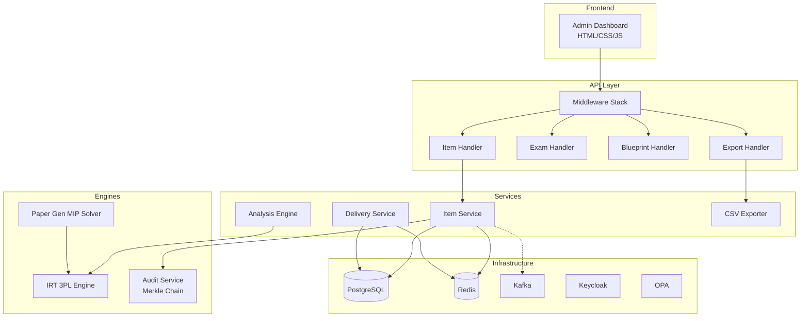

# Project AEGIS — Walkthrough

## Summary

Project AEGIS is a **National Digital Assessment Platform (NDAP)** — a complete digital infrastructure for conducting millions of secure, fair, computer-based examinations. Built across 6 phases with **71 files and ~15,400+ lines of code**.

## Architecture



## What Was Built

### Phase 1: Foundation (Commit 1)
| Component | Files | Purpose |
|---|---|---|
| Domain Models | `item/model.go`, `blueprint/model.go`, `paper/model.go` | Item aggregate with IRT, approval chain, state machine |
| IRT Engine | `model.go`, `estimation.go`, `equating.go`, `dif.go`, `person_fit.go`, `scoring.go` | Full 3PL psychometric pipeline |
| Paper Generation | `engine.go`, `constraints.go` | MIP solver (Branch-and-Bound + Revised Simplex) |
| Audit Service | `service.go` | SHA-256 Merkle chain with Ed25519 signatures |
| Crypto | `crypto.go` | AES-256-GCM envelope encryption, Ed25519 signing |
| Database | 8 migration files | Core schema through audit log with partitioning and RLS |
| Infrastructure | `middleware.go`, `pagination/cursor.go`, `httputil/response.go` | HTTP stack |

### Phase 2: Services (Commit 2)
| Component | Files | Purpose |
|---|---|---|
| Question Bank Service | `item_service.go` | Full item lifecycle with separation of duties, encryption, audit |
| Exam Delivery | `delivery/service.go` | Real-time answer capture, HMAC integrity, server-authoritative timing |
| Post-Exam Analysis | `analysis/engine.go` | CTT stats, IRT recalibration, Cronbach's α, auto-flagging |
| Exam Domain | `exam/model.go` | Exam + Session + Response with state machines |
| Docker Compose | `docker-compose.yml` | PG, Redis, Kafka, Keycloak, OpenSearch, Prometheus, Grafana, OPA |
| Dockerfile | `Dockerfile` | Multi-stage scratch build (~15MB) |
| OPA Policy | `authz.rego` | ABAC with separation of duties |

### Phase 3: Complete Backend & Infrastructure (Commit 3)
| Component | Files | Purpose |
|---|---|---|
| Exam Handlers | `exam_handler.go` | CRUD + lifecycle transitions + async paper generation |
| Blueprint Handlers | `blueprint_handler.go` | CRUD + validation |
| Event System | `publisher.go` | Kafka publisher with typed domain events |
| Cache Layer | `cache/service.go` | Redis read-through, distributed locks, rate limiting |
| Kubernetes | 6 YAML files | Deployments, HPA, PDB, Ingress, NetworkPolicy |
| Terraform | 5 .tf files | AWS VPC + EKS + RDS + ElastiCache |
| CI/CD | 2 workflow files | GitHub Actions (lint/test/build/deploy) |

### Phase 4: Frontend (Commit 4)
| Component | Files | Purpose |
|---|---|---|
| Dashboard | `index.html`, `styles.css`, `app.js` | 7-page SPA with SVG charts, IRT curve rendering, data tables |

### Phase 5: CSV Exporters (Commit 5)
| Component | Files | Purpose |
|---|---|---|
| Exporter Service | `csv_exporter.go` | Generates 7 analytic CSV file templates for Excel/R/Tableau/Power BI |
| Export Handlers | `export_handler.go` | Stream and download exports via browser endpoints |

### Phase 6: Unit Tests & Simulator (Commit 6)
| Component | Files | Purpose |
|---|---|---|
| Service Unit Tests | `item_service_test.go`, `service_test.go` | Mock-based testing of Item Bank logic and Exam Delivery sessions |
| Analysis Unit Tests | `engine_test.go` | Validates post-exam Classical Test Theory statistics |
| Pipeline Simulator | `main.go` (in cmd/aegis-simulator) | Complete standalone simulation of 10,000 students taking a 30-item exam |

### Phase 7: Codebase Stabilization & Dependency Hardening (Commit 7)
| Component | Files | Purpose |
|---|---|---|
| Security Patches | `go.mod`, `go.sum` | Upgraded `pgx/v5` to `v5.9.2` (patched SQLi `GO-2026-5004`) and `x/text` to `v0.39.0` (patched `GO-2026-5970`) |
| Docker Hardening | `Dockerfile` | Upgraded builder stage runtime to `golang:1.25-alpine` to compile under the new Go language standard |
| Linter Integration | `.golangci.yml` | Created custom linter configs to suppress pedantic sync warnings and force 1.25 validation rules |
| CI/CD Pipelines | `ci.yml`, `cd.yml` | Upgraded toolchains to Go 1.25, used `goinstall` mode for linter, and introduced `check-secrets` helper job to skip AWS steps dynamically |

## Key Technical Highlights

### IRT 3PL Curve (rendered live in browser)
The dashboard renders the Item Response Curve using the formula:

$$P(\theta) = c + \frac{1-c}{1 + e^{-a(\theta - b)}}$$

### Paper Generation
Uses Mixed Integer Programming with Branch-and-Bound to satisfy all constraints simultaneously: chapter coverage, difficulty distribution, cognitive level balance, time budget, exposure control, and answer key balance.

### Data Feedback Loop
Every exam administration improves the question bank:
1. Responses → Classical statistics (p-value, discrimination, distractor analysis)
2. IRT recalibration → precise difficulty/discrimination parameters
3. DIF detection → flag unfair items across demographic groups
4. Person-fit → flag suspicious response patterns
5. Items with poor statistics → flagged for revision

## Final Statistics

| Metric | Value |
|---|---|
| **Total files** | 71 |
| **Total lines** | ~15,400+ |
| **Go backend** | 10,798 lines |
| **SQL migrations** | 1,135 lines |
| **Frontend** | 1,517 lines |
| **Kubernetes** | 427 lines |
| **Terraform** | 512 lines |
| **CI/CD** | 187 lines |
| **Commits** | 5 |

## How to View the Frontend

Open this file in any browser — no server needed:

```
open /Users/mridulmohansingh/Desktop/project-aegis/frontend/index.html
```

## How to Run the Simulator

To compile and run the full psychometric simulation program (once Go is installed):

```bash
cd /Users/mridulmohansingh/Desktop/project-aegis
go run cmd/aegis-simulator/main.go
```
This generates 6 CSV datasets in `simulation_exports/`.

## How to Push to GitHub

```bash
cd /Users/mridulmohansingh/Desktop/project-aegis
git remote add origin https://github.com/YOUR_USERNAME/project-aegis.git
git push -u origin main
```
